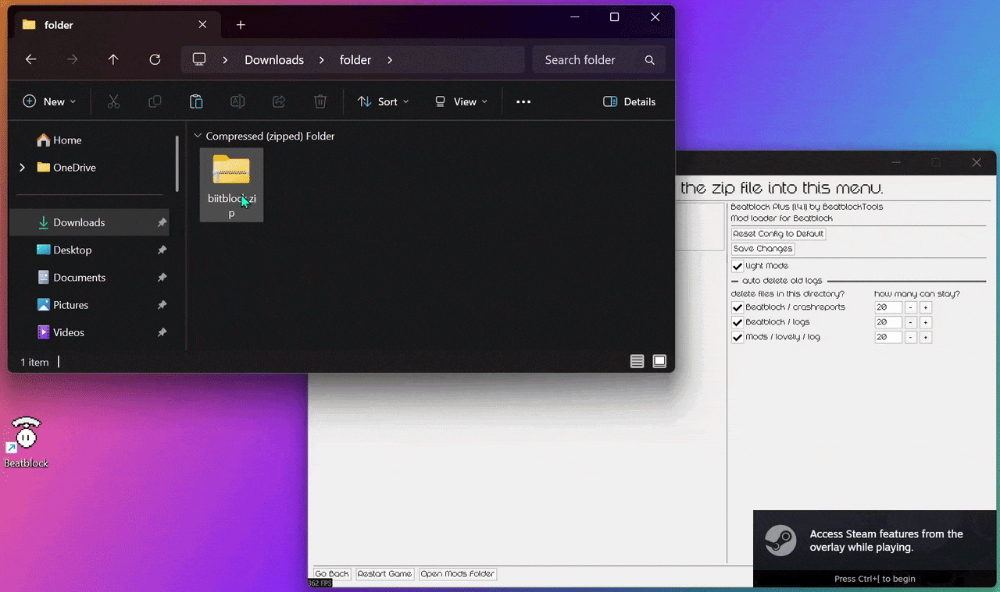

# Installing Mods
## Downloading the mod file
You can find all Beatblock mods in the EA-Mods forum of the Beatblock Modding Community. Once you found a post you're interested in, look for the newest mod zip file (often linked at the top) and download it. If there's a link to a Github repository instead, download the newest zip from there.

## Adding the mod to Beatblock
Once you have the zip file, simply open the Mods menu in Beatblock and drag the file into the game window.\
When you get the popup, saying that the mod was installed, you can restart your game.
[ Epic Recording of me installing biitblock ]

